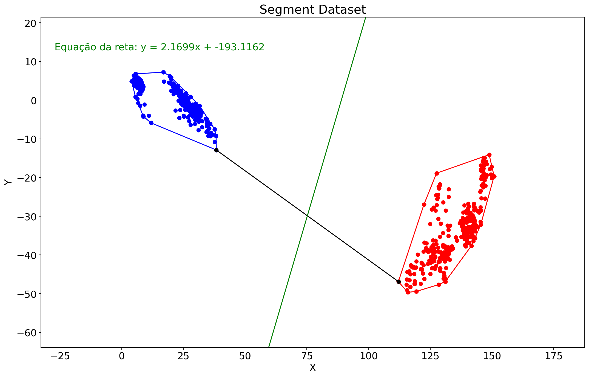

# Convex Hull Classifier
This is a Supervised Learning Classifier through Convex Hull models developed by:

[Gabriel Lima Barros](https://github.com/GabrielLimab)

[Gabriel Teixeira Carvalho](https://github.com/GabrielTeixeiraC)

[Thiago Pádua de Carvalho](https://github.com/paduathiago)

The classifier works as follows:

1. Separate the points into two Convex Hulls (Graham Scan Algorithm). If they are not linearly separable (Sweep-Line Algorithm for Segment Intersection using Red-Black Tree), return.
2. Connect the closest points between the two polygons.
3. Define the model as the bisector line of the closest points segment.
4. Classify the new points according to their position relatively to the model line.

